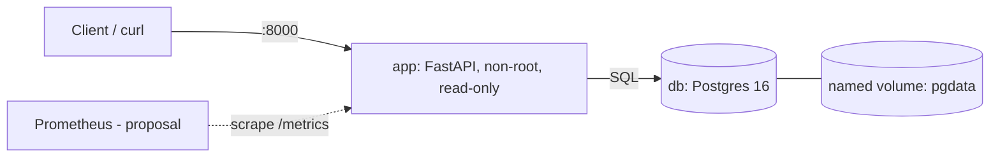
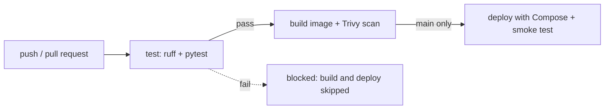
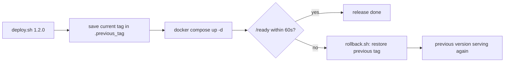

# Architecture and release flow

## Runtime (Docker Compose)

```mermaid
flowchart LR
    client[Client / curl] -->|:8000| app[app: FastAPI, non-root, read-only]
    app -->|SQL| db[(db: Postgres 16)]
    db --- vol[(named volume: pgdata)]
    prom[Prometheus - proposal] -.->|scrape /metrics| app
```

## CI/CD flow (GitHub Actions)

```mermaid
flowchart LR
    push[push / pull request] --> test[test: ruff + pytest]
    test -->|pass| build[build image + Trivy scan]
    test -.->|fail| stop[blocked: build and deploy skipped]
    build -->|main only| deploy[deploy with Compose + smoke test]
```

## Release and rollback

```mermaid
flowchart LR
    v1[deploy.sh 1.2.0] --> save[save current tag in .previous_tag]
    save --> up[docker compose up -d]
    up --> chk{/ready within 60s?}
    chk -->|yes| ok[release done]
    chk -->|no| rb[rollback.sh: restore previous tag]
    rb --> ok2[previous version serving again]
```
